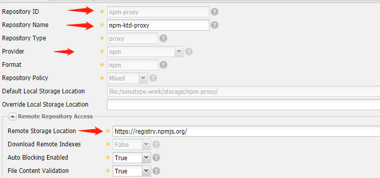
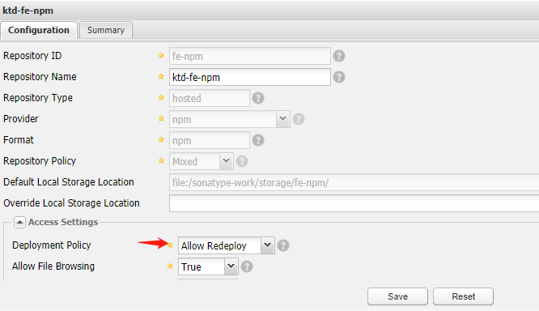

# 使用 Nexus Repository Manager OSS 搭建 NPM 私服

## 常用的几种搭建方式

- [sinopia](https://github.com/rlidwka/sinopia)
- [verdaccio](https://github.com/verdaccio/verdaccio)
- [cnpm](https://github.com/cnpm/cnpmjs.org)
- [Nexus Repository Manager](https://help.sonatype.com/docs)

## 方式选择

- 前两种相对来说搭建步骤比较简单快速，同时 verdaccio 依赖了 sinopia 模块。
- 后两种相对复杂，需要依赖其他软件。
- 建议选择前两种，由于团队之前有搭建过 Nexus Repository Manager（v2）作为 Maven 私服，所以这里选择 Nexus Repository Manager（v2）这种方式。

## 在 Nexus Repository Manager(v2)中搭建 NPM 私服

### 搭建

使用官方的 Docker 镜像 [sonatype/nexus](https://hub.docker.com/r/sonatype/nexus/) 进行搭建。（略）

### 登录

- 服务器地址：[http://127.0.0.1:8081](http://127.0.0.1:8081)，请把地址改为你的服务器地址。
- 默认用户名：admin
- 默认密码：admin123

### 配置

#### Proxying npm Registries（代理）

- 添加一个 Proxy Repository
- 配置 Repository ID（仓库 ID）、Repository Name(仓库名)、Provider(提供商选择 npm)、Remote Storage Location(外部代理源地址：如：[https://registry.npmjs.org](https://registry.npmjs.org)、[https://registry.npm.taobao.org](https://registry.npm.taobao.org))、其他默认或根据需要自行设置即可。



#### Private npm Registries（私有）

- 添加一个 Hosted Repository
- 填写常用的配置 Repository ID（仓库 ID）、Repository Name(仓库名)、Provider(提供商选择 npm)、Deployment Policy 等。



#### Grouping npm Registries（组）

- 创建 Repository Group
- 填充配置 Repository ID（仓库 ID）、Repository Name(仓库名)、Provider(提供商选择 npm)等
- 合并两个库前面创建的 proxy、hosted 库


#### Configuring npm

- 生成 .npmrc 文件

```shell
#npm config set registry `group address`
npm config set registry http://127.0.0.1:8081/content/groups/npm-fe-group/
```

- 配置.npmrc 文件

```bash
# npm注册地址，上面设置的私服地址
registry=http://127.0.0.1:8081/content/groups/npm-fe-group/
# an email is required to publish npm packages
email=yourname@gmail.com
# 授权
always-auth=true
# 鉴权，值为用户名：密码的base64编码，如下为`admin:admin123`的base64编码后的字符串
_auth=YWRtaW46YWRtaW4xMjM=
```

#### Publishing npm Packages(发布本地包模块到 npm 私服)

- 方式一

```bash
# 复制生成的hosted地址，在项目根目录下运行命令（必须存在package.json文件）
npm publish --registry http://127.0.0.1:8081/content/repositories/fe-npm/
```

- 方式二(在 package.json 文件中，添加如下配置,然后根目录下运行 `npm publish` 命令)

```json
"publishConfig" : {
    "registry" : "http://127.0.0.1:8081/content/repositories/fe-npm/"
  },
```

#### 测试下载地址是否为配置的注册地址

查看当前下载模块的（fetch）地址是否为配置的 registry 地址，下载提交私服 npm 的模块是否正确。

```bash
# 在.npmrc中配置了registry
npm --loglevel info install moment
# 没有配置，需每次带上registry参数
npm --loglevel info install moment --registry=http://127.0.0.1:8081/content/groups/npm-fe-group/
```

## 坑

- 某些版本不能安装 `@` 开头的 npm 包
- 某些版本无法使用淘宝源
- 某些版本无法安装某些 npm 包，比如：rc-select
- 有时间 npm 上小时前更新了的包，在私服找不到。可以在 proxy 的 Expiration setting 中设置 Not Found Cache TTL 的时间 缩短。

经过使用了十几个版本的 [Docker nexus 镜像](https://hub.docker.com/r/sonatype/nexus/) 进行测试，终于测试到有一个版本能够完美支持的， 即 **2.14.5-02**。:joy:

## 迁移

因为配置了 Nexus Repository Manager OSS 的 Docker 镜像把相关数据写到外部的物理硬盘中，所以只需修改相应的路径地址即可，具体配置参考[官方文档](https://hub.docker.com/r/sonatype/nexus/)。

## 参考

- [Node Packaged Modules and npm Registries v2](https://help.sonatype.com/repomanager2/node-packaged-modules-and-npm-registries#NodePackagedModulesandnpmRegistries-Configuringnpm)
- [npm docs](https://docs.npmjs.com/)
